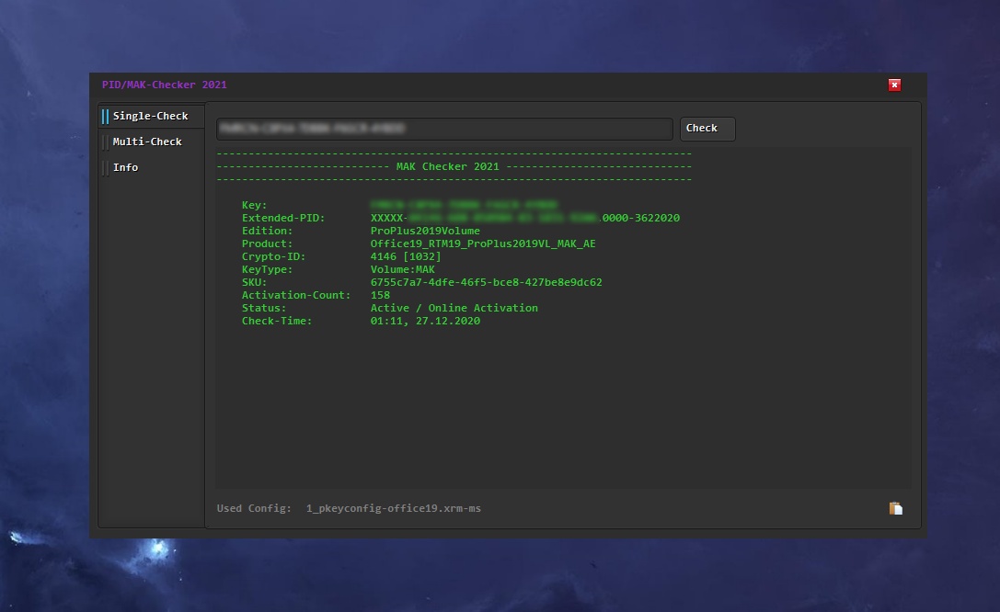
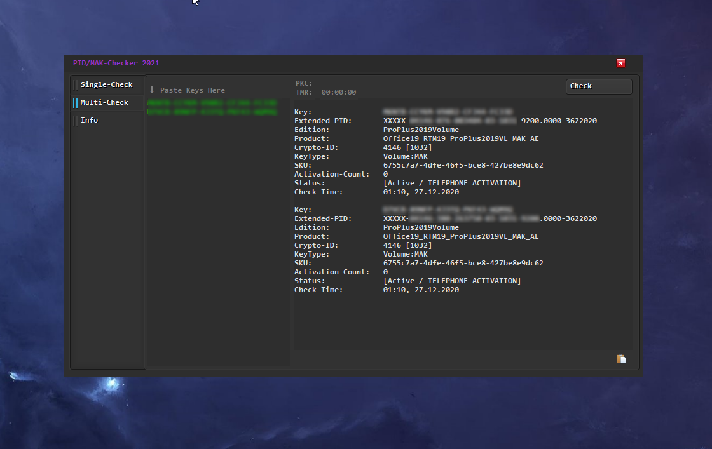

# MAK-Checker by Year0ne

With this Tool you can easily check Microsoft Volume/MAK Productcodes.

current Version: 1.6

Version 1.6 features / updates:
- [Bug-fix] Fixed Form Freeze while checking single-key
- added right click menu to paste multi-keys

Version 1.5 features / updates:

- Can autodetect Products by the inserted Productkey
- Check Single and Multi-Productcodes
- Supported from Windows 7 to Windows 10
- Supported office 2010  to Office 2019

------------------------------------------------------

Features for upcoming versions:
- Multilanguage
- Adding more Microsoft Applications for Keycheck
- Webcheck for Productkeys
- Faster receiving responses from Microsoft Server for checking

------------------------------------------------------

Currently Supported Products for Check:

Windows 10 Home
Windows 10 Professional
Windows 10 Professional N
Windows 10 Workstation
Windows 10 Education
Windows 10 Enterprise
Windows 10 EnterpriseS
Windows 10 EnterpriseSN

Windows 8 Professional
Windows 8 Enterprise

Windows 8.1 Professional
Windows 8.1 Enterprise

Windows 7 - all Editions

Microsoft Office 2010 Standard
Microsoft Office 2010 Professional
Microsoft Office 2010 Professional Plus

Microsoft Office 2013 Standard
Microsoft Office 2013 Professional
Microsoft Office 2013 Professional Plus

Microsoft Office 2016 Standard
Microsoft Office 2016 Professional
Microsoft Office 2016 Professional Plus

Microsoft Office 2019 Standard
Microsoft Office 2019 Professional
Microsoft Office 2019 Professional Plus

[BETA]
Microsoft Visual Studio 2010
Microsoft Visual Studio 2012
Microsoft Visual Studio 2013
Microsoft Visual Studio 2015
Microsoft Visual Studio 2017
Microsoft Visual Studio 2019
